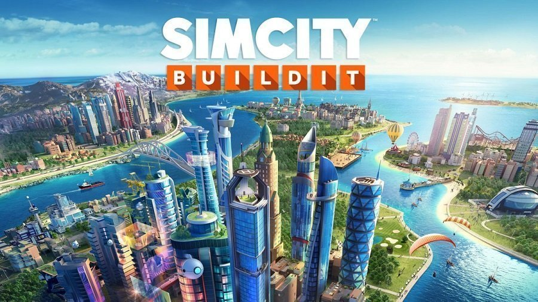
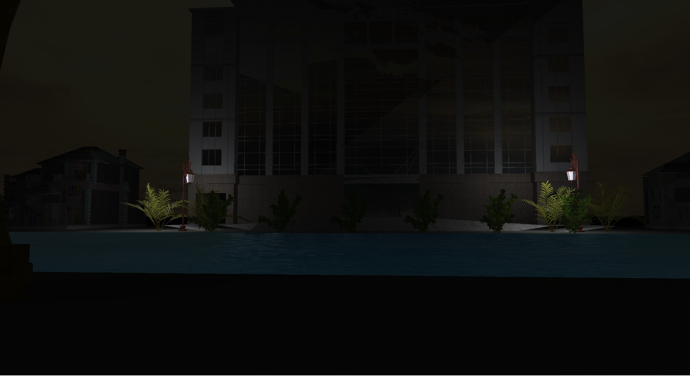
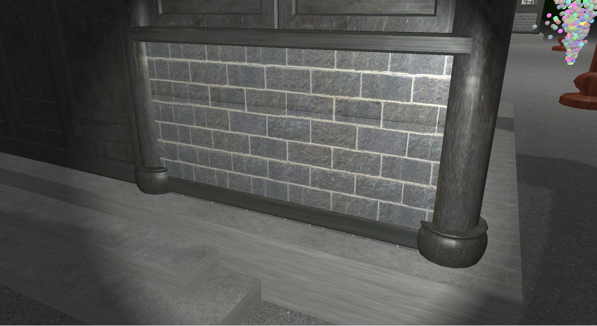
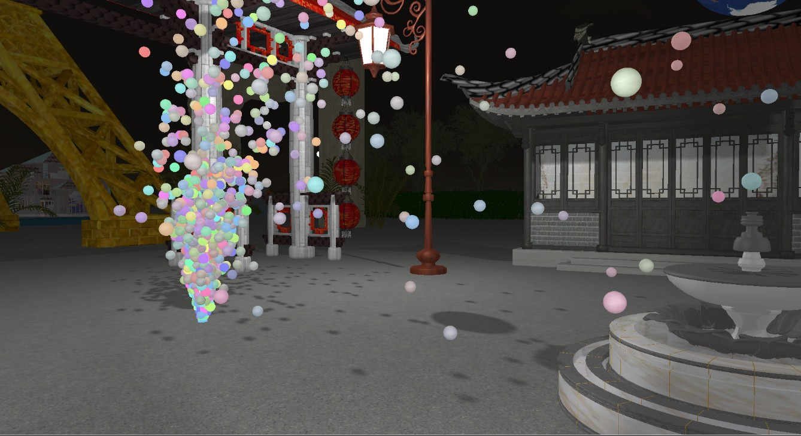
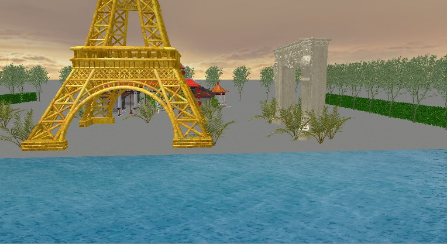
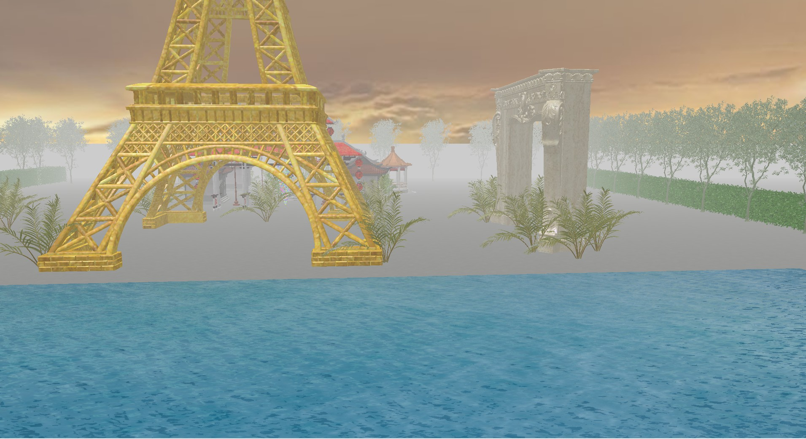
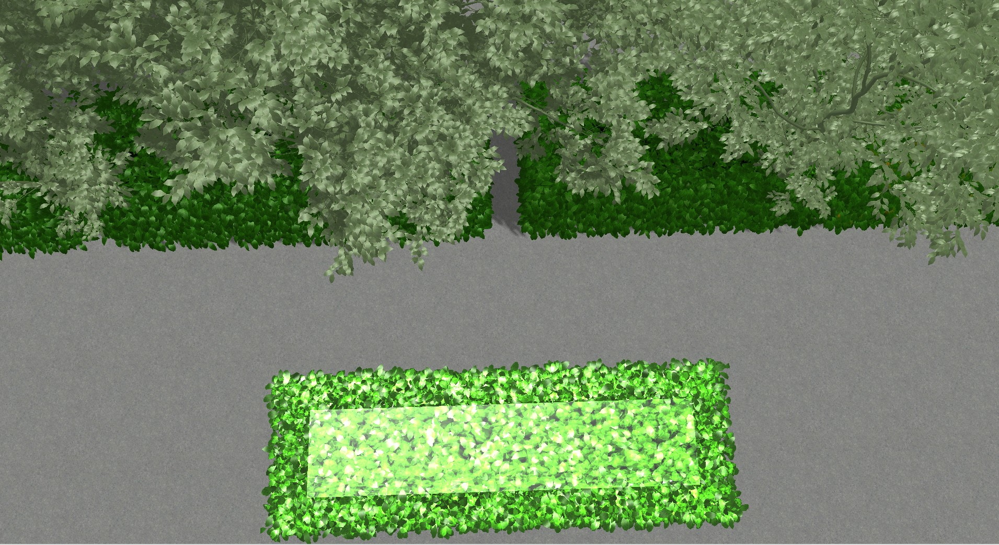
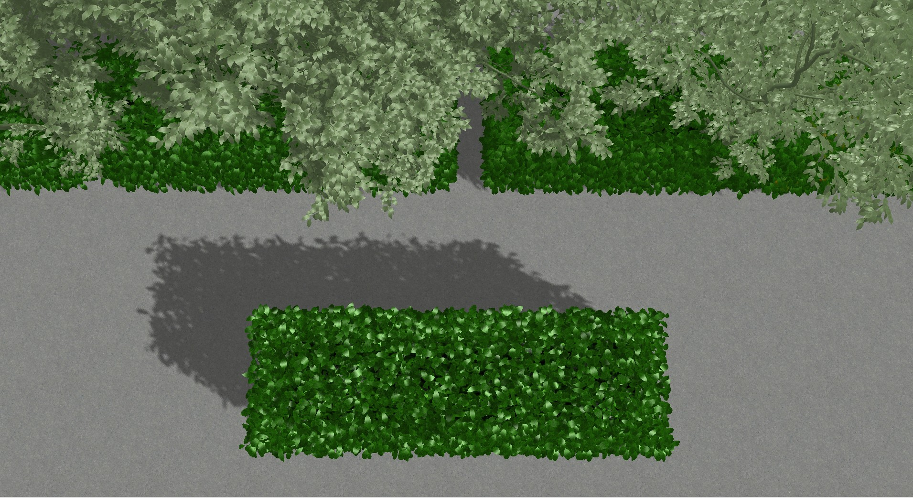

# “OpenCity” Game Project 

- ###### Developed the “OpenCity” inspired by the game “SimCity” 

- ###### Rendered images within the OepnGL framework 

- ###### patent no.: 2022SR0805651, 2021, `Copyright Protection Center of China`

###### A short demo video:

https://user-images.githubusercontent.com/58615742/202679030-2e984b8b-221c-4f77-90b1-15d4ea58c340.mp4

## Project Content

###### Simple 3D modeling and realistic rendering

### Basic Requirements

1. Based on OpenGL, it has the modeling and rendering ability of basic voxels (eg. cube, sphere, cylinder, cone, polyhedral prism).
2. It has the import and export ability for basic 3D mesh ('obj' format).
3. Have the ability to display and edit basic materials and textures, including material maps, diffuse maps, specular maps, normal maps, displacement textures, etc;
4. Basic geometric transformation functions (rotation, translation, scaling, etc.);
5. Basic lighting model functions and light source editing. In the project, we realized the multi-light source rendering of parallel light, point light and spotlight.

6. Roam the scene after modeling, such as Zoom in/out, Pan, Orbit, Zoom To Fit and other observation functions
7. Shader depth detection to achieve fog effect;
8. Various particle systems.
9. gamma correction
10. hdr correction
11. Sky Box with Rotation

https://user-images.githubusercontent.com/58615742/202677355-26596674-952c-41fc-9fb2-0a83c867816d.mp4

### Additional Realization of this Project

1. Real time collision detection is available when roaming (AABB bounding box). 

2. The lighting model is refined. Realize PCF real-time shadow mapping and water wave displacement texture.

## How to Play

### Game Start

Use visual studio 2017 (or other supported visual studio versions) to open `Open_City\vsbuild\vsbuild.sln`, then compile and run in the Realse mode.

Due to the large obj files loaded in the program, the memory requirements are high. If the bad alloc problem occurs during the operation, it may be caused by insufficient memory. It is recommended to run the program on a computer with `16GB` or more of memory.

### Enter the Initial Interface of the Game

Enter `ENTER` on the interface to enter the game.

### Keys and Mouse Settings

- Players control character movement through `W/A/S/D`

- Move `mouse` to switch the view angle

- Slide `mouse wheel` to achieve `zoom in/out`

- `shift` can realize movement acceleration

- Press key `1/2` to switch the perspective (first person perspective, God roaming perspective)

- Press key `Q/E` enable/disable parallel lighting

- Press key `O/P` to open/close gamma correction

- Press key `K/L` to open/close hdr correction

- Press key `U/I` to turn on/off shadow

- Press key `H/J` to open/close fog effect switch

- Press key `N/M` to turn on/off point light source

- Press key `V/B` to turn on/off spotlight

- Press key `3/4` to open/close destroy mode, in which any object ran into the player will be destroyed 

- Press key `5/6` to open/close the function to restore the damaged

- Press key `7` to open/close snowflake particle effect

- Press key `8` to open/close raindrop particle effect

- Press key `9` to open/close fireworks particle effect

- Press key `0` to open/close fountain particle effect

- Press key `R/T` to open/close construction mode

  When the construction mode is enabled, you can click `right mouse button` to switch the model. Select the construction position by movement through `W/A/S/D`, and click `left mouse button` to confirm the construction.

## Demonstration

###### Point Light Source

###### Spot Light

https://user-images.githubusercontent.com/58615742/202676484-60a5e3c7-0e54-4b21-9abe-09ae3c1e4743.mp4

###### Real-Time Shadows

https://user-images.githubusercontent.com/58615742/202676525-b00dac84-f1c6-45d9-bdc8-a226b543e42c.mp4

###### Particle Systems

<video src="../../MyCollege/大三上/计算机图形学/Project/opencity_video/particle system.mp4"></video>

###### Fog Effect

- ###### without Fog Effect

  

- ###### with Fog Effect

  

- ###### Video Demonstration

https://user-images.githubusercontent.com/58615742/202676660-b06d6f0b-418b-49db-91e7-e1ee40997771.mp4

###### Water Wave

- ###### Shadows of Objects Nearby

https://user-images.githubusercontent.com/58615742/202676723-d05fb178-963d-4f46-bbf0-b8ec4bdc417f.mp4

- ###### Reflective Effect Changes with Angle Changes 

https://user-images.githubusercontent.com/58615742/202676751-4a55ad10-abbb-4e29-8d58-c5fc1fd3f887.mp4

###### Particle Systems

Snowflare, raindrop, fireworks, and fountain, respectively.

https://user-images.githubusercontent.com/58615742/202689889-d747e55f-c46d-4607-8e1f-37c378ba96df.mp4

###### Construction Mode

## Group Members

`Haoyi Duan`

`Chenning Tao`

`Zhengtao Xu`

## References

###### Learning Materials

[LearnOpenGL CN (learnopengl-cn.github.io)](https://learnopengl-cn.github.io/)

###### Model Recourses

https://free3d.com/ 

https://www.turbosquid.com/

https://www.aigei.com/

###### Water Wave Texture Reference

https://youtu.be/HusvGeEDU_U

###### Particle Effect Reference

https://blog.csdn.net/dcba2014/article/details/52290521

[https://learnopengl-cn.github.io/06%20In%20Practice/2D-Game/06%20Particles/](https://learnopengl-cn.github.io/06%20In%20Practice/2D-Game/06%20Particles/)
